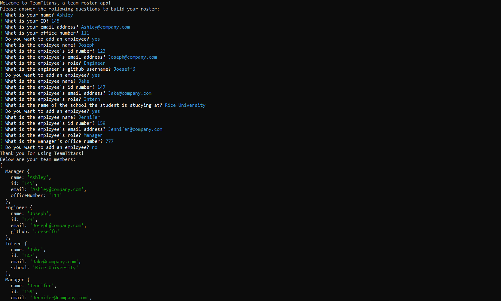
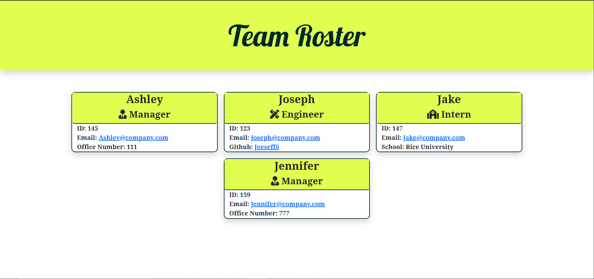
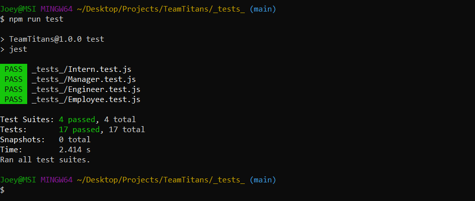

# TeamTitans
A command-line application using Node.js to generate a team profile.

## Project Description

The purpose of this project is to generate cards that visually represent the user's team. Javascript and Node.js will be the main technologies used in this project, as this application will use a command-line interface.
## What to Expect From the Application

When the user invokes the application, they will go through a series of questions describing their team members. Such questions include the first name of the team members, their role, email, and additional information based on the member's role. Once the user is done adding team members to the roster, the application will end and a HTML file will be generated.

The HTML will be polished, responsive, and will contain links to profiles, emails, etc. Applications like this are useful in real-life scenarios where a team roster can be distributed to help team members get to know each other.

## Technologies and Techniques Used

* HTML
* CSS
* Bootstrap
* Javascript
* Node.js
* npm
    * jest: to run test cases for js files
    * inquirer: to prompt the user for data storage
* Modularization
* OOP (Object-Oriented Programming)
## Tasks to Complete the Job :white_check_mark:

- [x] When the user invokes the application, the user will be greeted with a message and the first question
- [x] When the user answers the first set of questions, they will be asked if they want to add any more employees
- [x] If the user selects yes, they will be greeted with questions about their employee
- [x] If the user selects no, they will be greeted with an end message and their HTML file will be generated
- [x] The HTML file generated will be styled and use the user's input to build a team roster
- [x] All tests for this application will pass
- [x] The emails and links provided in the HTML will be fully operable, including clickable email addresses that uses the user's default email application

## Screenshots

